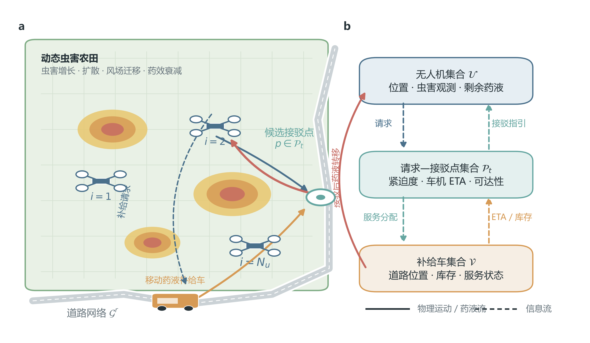
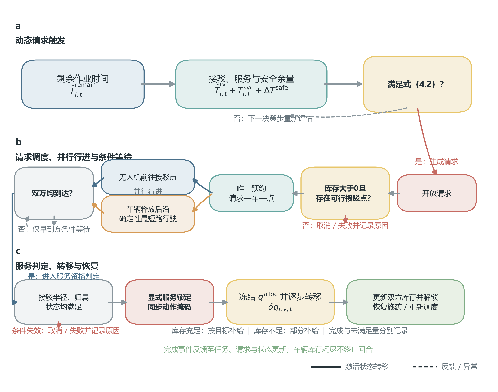

# 4.1 问题描述与空地协同保障机制设计

在动态虫害演化与多无人机协同施药模型的基础上，本章进一步考虑机载药液有限时的持续作业问题。与将无人机药液视为无限资源的规划情形不同，有限载荷使单架无人机难以在整个决策周期内连续施药。当剩余药液不足时，无人机不仅需要调整虫害区域的访问顺序，还必须确定何时提出补给需求、前往何处与地面保障单元接驳，以及如何在等待与绕行代价可控的条件下恢复作业。与此同时，移动药液补给车受道路拓扑、行驶速度、剩余库存和服务能力约束，无法直接到达任意农田栅格。由此，原有的空中协同路径规划转化为空中施药任务与地面移动保障相互耦合的联合决策问题。

本节从作业实体、补给需求、服务过程和耦合关系四个层面明确研究边界。需要说明的是，本节仅建立模型规格与后续验证口径，不预设移动保障或 SR-MAPPO 的性能结论；无人机载药容量、车辆库存、行驶速度、补给速率、服务时间和接驳半径等工程参数将在实验设置中依据设备资料、田间研究或专家确认范围完成标定并冻结。

## 4.1.1 作业场景与系统构成

研究区域表示为二维农田区域 $\Omega\subset\mathbb{R}^{2}$，其中 $\mathbb{R}$ 表示实数集合；区域按空间分辨率离散为 $H\times W$ 个栅格。各栅格包含虫害密度、作物或地表属性以及药效状态等信息；虫害在生长、扩散、风场迁移和药剂作用下随时间演化。为兼顾生态过程的数值计算精度与智能体决策频率，本文区分生态积分步长 $\delta t_{\mathrm{eco}}$ 和物理决策步长 $\Delta t_{\mathrm{dec}}$。一个决策步内可执行若干次生态状态更新，即 $\Delta t_{\mathrm{dec}}=K\delta t_{\mathrm{eco}}$，其中 $K$ 为正整数。后续涉及飞行、车辆行驶、等待和服务的时间量均以物理时间计量，避免将仿真迭代次数直接等同于实际作业时间。

设无人机集合为 $\mathcal U=\{1,2,\ldots,N_u\}$。无人机在农田栅格内执行移动、施药、等待和接驳等行为，并依据局部虫害状态、自身位置、剩余药液及可获得的协同信息进行决策。对无人机 $i$，以 $\boldsymbol x^u_{i,t}$ 表示时刻 $t$ 的位置，以 $q_{i,t}$ 和 $q_i^{\max}$ 分别表示其剩余药液量和载药容量，单位均为 L。药液只在有效施药或补给事件中发生变化，飞行能耗不在本章作为补给对象，因此不能将药液补给机制解释为电池补能机制。

地面保障系统由移动药液补给车和道路网络构成。道路网络抽象为带权图 $\mathcal G^r=(\mathcal V^r,\mathcal E^r)$，其中 $\mathcal V^r$ 为道路节点集合，$\mathcal E^r$ 为可通行路段集合，边权用于表示道路距离或行驶时间。车辆集合记为 $\mathcal V=\{1,2,\ldots,N_v\}$，车辆 $v$ 在时刻 $t$ 的道路位置和剩余库存分别记为 $\boldsymbol x^g_{v,t}$ 与 $Q_{v,t}$。本文主实验采用单辆补给车，以突出移动保障位置对协同施药的影响；集合化符号仅用于保持模型的可扩展性。车辆不能脱离道路图自由穿越农田，其策略层负责选择待服务请求或候选接驳点，确定性最短路执行器负责将该高层决策转换为道路上的可行路径。

候选接驳点集合记为 $\mathcal P_t$。每个接驳点均与可达道路节点关联，并满足无人机能够进入服务半径的空间条件。接驳点既不是任意农田位置，也不是仅用于绘图的道路投影点；其有效性需要同时通过道路连通性、车辆可达性、无人机可达性和服务几何约束检验。图4-1给出了空地协同施药系统的实体构成与主要交互关系。其中，实线表示无人机或车辆的物理运动与药液转移，虚线表示补给请求、预计到达时间和库存等信息交互。道路数据仅用于构造具有实际拓扑特征的仿真输入，不作为真实部署验证的替代。

**图4-1  空地协同施药系统构成与交互关系**

## 4.1.2 有限机载药液下的动态补给需求

有限载药条件下，补给需求不应仅由固定药量阈值触发。原因在于，相同剩余药量对不同作业状态具有不同含义：处于高虫害热点并持续施药的无人机，其药液消耗速度较快；处于转场或低负荷状态的无人机，即使剩余药量相同，也可能具有更长的可持续作业时间。此外，补给车与无人机到候选接驳点的距离、道路绕行、已有服务队列和补给耗时都会影响请求的合理提前量。因此，本文以剩余药液可支持的作业时间作为需求评估基础。

设 $\bar\rho^{\mathrm{spr}}_{i,t}$ 为根据近期有效施药记录、未来任务负荷及预计施药占空比得到的物理时间期望药液消耗率，单位为 L/s。该量将施药动作的瞬时流量折算到连续物理时间尺度，因而式中时间可以与飞行、排队和接驳时间直接比较；$\varepsilon$ 为避免分母为零而设置的最小消耗率，单位同为 L/s。无人机 $i$ 在时刻 $t$ 的剩余药液可支持作业时间定义为

$$
\hat T^{\mathrm{remain}}_{i,t}=\frac{q_{i,t}}{\max\left(\bar\rho^{\mathrm{spr}}_{i,t},\varepsilon\right)} . \tag{4.1}
$$

式中，$\hat T^{\mathrm{remain}}_{i,t}$ 的单位为 s。当无人机没有待执行施药任务或期望消耗率低于最小有效阈值时，不依据式（4.1）单独生成紧急请求，而是保留其资源状态并在后续决策步重新评估。

设 $\mathcal P_t(i,v)\subseteq\mathcal P_t$ 为无人机 $i$ 与车辆 $v$ 在时刻 $t$ 的可行接驳点集合，$\hat T^{\mathrm{arr}}_{i,v,p,t}$ 为双方均到达接驳点 $p$ 且车辆已从既有预约中释放的预计时长。预计接驳时间 $\hat T^{\mathrm{rv}}_{i,t}$ 定义为全部可行“车辆—接驳点”组合中的最早服务就绪时长，不包含本次药液转移的服务持续时间。另设 $T^{\mathrm{svc}}_{i,t}$ 为预计服务时间，$\Delta T^{\mathrm{safe}}$ 为吸收虫害变化、道路绕行和到达时间估计误差的安全余量，单位均为 s，则请求触发条件为

$$
\begin{aligned}
\hat T^{\mathrm{rv}}_{i,t}
&=\min_{\substack{v\in\mathcal V,\;p\in\mathcal P_t(i,v)}}
\hat T^{\mathrm{arr}}_{i,v,p,t},\\
\hat T^{\mathrm{remain}}_{i,t}
&\leq \hat T^{\mathrm{rv}}_{i,t}+T^{\mathrm{svc}}_{i,t}+\Delta T^{\mathrm{safe}}.
\end{aligned}
\tag{4.2}
$$

当式（4.2）成立时，系统允许无人机 $i$ 生成补给请求。该条件比较的是同一物理时间尺度下的剩余作业时长与“接驳就绪、完成服务及安全余量”之和，既避免将服务时间重复计入接驳时间，也使触发时刻随无人机任务负荷、车机相对位置和已有预约动态变化。安全余量的取值将在敏感性实验中单独考察，避免通过过大的提前量人为降低等待风险。

每个请求至少记录请求编号、无人机编号、生成时刻、当前位置、剩余药量、目标补给量、紧迫度和可行候选接驳点。请求生成后进入开放状态，尚未被车辆接受时允许继续更新预计到达时间与紧迫度；一旦被某车辆预约，则建立请求—车辆—接驳点的唯一关联，以避免同一需求被重复服务。若无人机在等待过程中因任务变化、候选点失效或回合结束而取消请求，状态机必须记录取消原因，而不能将空请求误判为服务完成。

动态需求机制同时用于区分两类资源瓶颈。若系统总药液量不足，即使车辆能够即时到达，仍会出现大量未满足需求；若总药液基本充足，但库存长期停留在远离需求的位置，则主要表现为接驳距离、等待时间和药液失能时间增加。后续实验将通过无限药液、有限药液无补给、固定保障、即时补给诊断上界和道路约束移动保障等模式区分“总量不足”与“位置—时间错配”，从而检验移动补给机制是否真正被激活。

## 4.1.3 车机接驳与补给服务机制

补给请求形成后，车辆策略从开放请求及其候选接驳点中选择服务目标。该决策属于任务层调度，而非直接输出车辆在栅格上的逐步移动方向。接驳点确定后，车辆沿道路图 $\mathcal G^r$ 的最短可行路径行驶；无人机则在保证施药与资源安全的前提下前往同一接驳区域。该分层设计使强化学习负责具有协同性和长期影响的目标选择，同时由确定性路径执行器保证车辆运动始终满足道路拓扑约束。

对请求无人机 $i$、车辆 $v$ 和候选接驳点 $p$，设 $d_u(\boldsymbol x^u_{i,t},p)$ 为无人机到接驳点的可行飞行距离，$d_{\mathcal G^r}(\boldsymbol x,p)$ 为道路图 $\mathcal G^r$ 上的最短路径距离，单位均为 m；$v_i^u$ 和 $v_v^g$ 分别为无人机与车辆的作业速度，单位为 m/s。考虑车辆可能已有预约任务，以 $T^{\mathrm{rel}}_{v,t}$ 表示车辆完成既有预约后相对于时刻 $t$ 的预计释放时长，以 $\boldsymbol x^{g,\mathrm{rel}}_{v,t}$ 表示对应的预计释放道路位置。忽略尚未发生的随机扰动时，无人机到达时长、车辆服务就绪到达时长及双方联合到达时长为

$$
\begin{aligned}
\hat T^u_{i,p,t}&=\frac{d_u(\boldsymbol x^u_{i,t},p)}{v_i^u},\\
\hat T^{g,\mathrm{ready}}_{v,p,t}
&=T^{\mathrm{rel}}_{v,t}
+\frac{d_{\mathcal G^r}(\boldsymbol x^{g,\mathrm{rel}}_{v,t},p)}{v_v^g},\\
\hat T^{\mathrm{arr}}_{i,v,p,t}
&=\max\left\{\hat T^u_{i,p,t},\hat T^{g,\mathrm{ready}}_{v,p,t}\right\}.
\end{aligned}
\tag{4.3}
$$

式（4.3）从车辆完成既有预约后的释放位置继续计算后续路网行程，避免将当前车辆位置与排队时长直接相加所造成的时空不一致。车辆只有在释放并抵达候选接驳点后才具备服务条件，双方联合到达时长由无人机到达时长与车辆服务就绪到达时长中的较大者决定。据此，车机因到达不同步产生的等待时长可表示为

$$
\hat T^{\mathrm{wait},u}_{i,v,p,t}=
\max\left(0,\hat T^{g,\mathrm{ready}}_{v,p,t}-\hat T^u_{i,p,t}\right),\qquad
\hat T^{\mathrm{wait},g}_{i,v,p,t}=
\max\left(0,\hat T^u_{i,p,t}-\hat T^{g,\mathrm{ready}}_{v,p,t}\right).
\tag{4.4}
$$

其中，两类等待时间的单位均为 s，且同一组合下至多有一项大于零；若双方同时到达，则均为零。因此，等待是到达不同步时的条件状态，而不是接驳服务的必经阶段。实际请求等待时间还应从请求生成时刻累计至服务开始时刻，并在事件日志中保留请求排队、在途和接驳等待的分项记录。

只有当车辆到达对应道路节点、无人机进入接驳半径、请求归属一致、车辆库存大于零且双方均处于可服务状态时，服务才能开始。开始服务后，请求进入显式的服务锁定状态。在锁定期间，无人机不得执行移动或施药动作，车辆不得切换服务目标；可行动作集合及其掩码必须与该状态同步更新，并在策略采样和训练更新阶段保持一致。这样可避免环境在策略输出之后静默覆盖动作，进而造成行为策略与训练策略不一致。

设 $q^{\mathrm{req}}_{i,t}$ 为请求生成时确定的目标补给量，$q^{\mathrm{svc}}_{\max}$ 为单次服务允许转移的最大药液量，单位均为 L。若该请求在 $t^{\mathrm{start}}_{i,v}$ 时刻开始服务，则本次服务分配总量 $q^{\mathrm{alloc}}_{i,v,t^{\mathrm{start}}}$ 与决策步 $t$ 内的实际转移量 $\delta q_{i,v,t}$ 定义为

$$
\begin{aligned}
q^{\mathrm{alloc}}_{i,v,t^{\mathrm{start}}}
&=\min\left\{q^{\mathrm{req}}_{i,t^{\mathrm{start}}},\;
q_i^{\max}-q_{i,t^{\mathrm{start}}},\;Q_{v,t^{\mathrm{start}}},\;q^{\mathrm{svc}}_{\max}\right\},\\
\delta q_{i,v,t}
&=I^{\mathrm{tr}}_{i,v,t}\min\left\{
\left[q^{\mathrm{alloc}}_{i,v,t^{\mathrm{start}}}
-\sum_{\tau=t^{\mathrm{start}}_{i,v}}^{t-1}\delta q_{i,v,\tau}\right]_{+},\;
\rho^{\mathrm{svc}}\Delta t_{\mathrm{dec}}\right\}.
\end{aligned}
\tag{4.5}
$$

式中，$I^{\mathrm{tr}}_{i,v,t}\in\{0,1\}$ 为药液转移激活指示量，仅在服务准备完成且双方保持锁定时取 1；$[\cdot]_{+}$ 表示非负截断；$\rho^{\mathrm{svc}}$ 为补给速率，单位为 L/s。式（4.5）先在服务开始边界冻结一次服务总分配量，再按决策步转移药液，从而避免在每个决策步重复计入整次服务量。当车辆库存或服务上限不足以满足目标补给量时，系统执行部分补给并记录未满足量。对应服务持续时间为 $T^{\mathrm{setup}}+q^{\mathrm{alloc}}_{i,v,t^{\mathrm{start}}}/\rho^{\mathrm{svc}}$，其中 $T^{\mathrm{setup}}$ 为服务准备时间。服务完成后释放双方锁定，无人机恢复施药决策，车辆重新进入可调度状态。车辆库存耗尽本身不触发回合终止；其后车辆不再具有有效补给动作，但无人机仍可利用剩余药液继续作业。

图4-2将上述过程组织为“时间预测—请求开放—库存与可行性检查—车机并行行进—联合到达—服务锁定—逐步转移—恢复施药”的离散事件流程。开放、预约、在途、条件等待、服务、完成、取消和失败均应具有明确的进入条件、状态更新和事件记录字段。该流程既作为强化学习环境的状态转移依据，也作为动态需求调度—滚动 A* 等传统保障方法的共同服务接口，从而保证不同车辆策略在相同物理约束下比较。

**图4-2  动态补给请求与车机接驳服务流程**

## 4.1.4 空地协同的时间、空间与资源关系

空地协同施药首先表现为空间耦合。无人机可以在农田区域内直接接近虫害热点，而车辆只能沿道路网络移动，两类主体的可达空间并不一致。候选接驳点需要在道路可达位置与无人机可接受绕行范围之间取得平衡：接驳点过于靠近车辆可能增加无人机脱离施药区域的距离，过于靠近虫害热点则可能导致车辆沿路网大幅绕行甚至不可达。因此，接驳决策的有效距离不能仅以欧氏距离衡量，还需同时考虑无人机飞行距离、车辆路网距离以及道路与农田之间的服务几何关系。

其次，补给过程具有显著的时间耦合。无人机过早到达会增加等待和施药中断，车辆过早到达则会占用保障资源并延迟后续请求；任何一方过晚到达都可能使无人机在完成当前任务前耗尽可用药液。补给请求的提前量、车机预计到达时间、已有服务队列和服务持续时间共同决定了接驳是否及时。因而，车辆调度不能只按照请求生成顺序执行，无人机也不能仅按最短飞行距离选择接驳点，而应结合请求紧迫度与联合到达关系进行协调。

再次，药液转移构成资源耦合。设 $s_{i,t}$ 为决策步 $t$ 内无人机 $i$ 的实际施药量，单位为 L；设 $I^{\mathrm{svc}}_{i,v,t}\in\{0,1\}$ 表示无人机 $i$ 与车辆 $v$ 在该步处于服务锁定关系。单步药液更新及基本可行性约束为

$$
\begin{aligned}
q_{i,t+1}
&=q_{i,t}-s_{i,t}+\sum_{v\in\mathcal V}\delta q_{i,v,t},\\
Q_{v,t+1}
&=Q_{v,t}-\sum_{i\in\mathcal U}\delta q_{i,v,t},\\
0\leq q_{i,t}&\leq q_i^{\max},\qquad
Q_{v,t}\geq0,\qquad 0\leq s_{i,t}\leq q_{i,t},\\
\sum_{v\in\mathcal V}I^{\mathrm{svc}}_{i,v,t}&\leq1,\qquad
\sum_{i\in\mathcal U}I^{\mathrm{svc}}_{i,v,t}\leq1,\\
0\leq\delta q_{i,v,t}
&\leq q^{\mathrm{alloc}}_{i,v,t^{\mathrm{start}}}.
\end{aligned}
\tag{4.6}
$$

在忽略泄漏并允许数值舍入误差的条件下，系统总药液应满足

$$
\sum_{i\in\mathcal U}q_{i,t}+\sum_{v\in\mathcal V}Q_{v,t}
+\sum_{\tau=0}^{t-1}\sum_{i\in\mathcal U}s_{i,\tau}
=\sum_{i\in\mathcal U}q_{i,0}+\sum_{v\in\mathcal V}Q_{v,0}.
\tag{4.7}
$$

式（4.6）和式（4.7）分别给出单步库存更新、服务唯一性与全局药液守恒关系。任何逐步转移量 $\delta q_{i,v,t}$ 都必须在无人机端增加并在车辆端等量扣减；部分补给、库存耗尽和同时请求等情形均应通过同一守恒审计。该约束能够识别整次服务量重复入账、负库存和环境状态更新遗漏，是后续算法训练前必须通过的确定性验证条件。

上述三类关系进一步产生任务层面的耦合：车辆服务某一请求，会改变其他无人机可获得服务的时间；无人机选择接驳点，会同时改变其施药覆盖、药液消耗和车辆后续位置；车辆完成一次补给后所在道路节点，又会影响下一请求的服务代价。因此，移动保障的潜在作用并非简单增加系统药液总量，而是调整药液资源在时间和空间上的分布。后续机制分析将依次考察移动保障是否缩短接驳距离、减少等待与药液失能时间、增加有效施药时间，并据此检验治理效果是否改善。

## 4.1.5 研究目标与关键问题

针对上述空地异构协同过程，本文的研究目标是在虫害动态演化、无人机机载药液有限、车辆库存有限和道路可达性约束下，联合优化多无人机施药行为与移动补给车服务决策。设 $\eta_{\mathrm{red}}$ 为回合结束时的虫害消减率，$\mathbb I(\eta_{\mathrm{red}}\geq0.85)$ 为治理达标指示量，$T^{\mathrm{wait}}$、$T^{\mathrm{off}}$、$D^u_{\mathrm{rv}}$ 和 $D^g$ 分别表示累计补给等待时间、药液失能时间、无人机接驳绕行距离和车辆道路行驶距离。为避免时间与距离量直接相加，分别以正参考尺度 $T^{\mathrm{ref}}$、$D^{u,\mathrm{ref}}$ 和 $D^{g,\mathrm{ref}}$ 进行归一化，并记 $\widetilde T^{\mathrm{wait}}=T^{\mathrm{wait}}/T^{\mathrm{ref}}$、$\widetilde T^{\mathrm{off}}=T^{\mathrm{off}}/T^{\mathrm{ref}}$、$\widetilde D^u_{\mathrm{rv}}=D^u_{\mathrm{rv}}/D^{u,\mathrm{ref}}$、$\widetilde D^g=D^g/D^{g,\mathrm{ref}}$。则有限时域内的高层概念目标可表示为

$$
\max_{\Pi}\;\mathbb E_{\Pi}\!\left[
w_1\eta_{\mathrm{red}}
+w_2\mathbb I\!\left(\eta_{\mathrm{red}}\geq0.85\right)
-w_3\widetilde T^{\mathrm{wait}}-w_4\widetilde T^{\mathrm{off}}
-w_5\widetilde D^u_{\mathrm{rv}}-w_6\widetilde D^g
\right],\qquad w_k\geq0,\quad k=1,2,\ldots,6.
\tag{4.8}
$$

其中，$\Pi$ 表示空地异构主体的联合策略，$w_k$ 为无量纲目标项权重。式（4.8）仅用于说明治理收益、施药连续性和保障代价之间的概念关系，不等同于已经验证的训练奖励，也不预设移动保障或 SR-MAPPO 的性能结论。具体状态、动作、团队奖励和 SR-MAPPO 优化形式将在后续章节中给出；参考尺度与权重需在训练数据或验证场景上冻结，并通过消融和敏感性分析检验。

围绕该目标，需要解决三个关键问题。第一，如何在无人机负责移动与施药、车辆负责需求服务选择且二者动作语义不同的条件下，建立共享治理目标下的空地异构联合决策机制。第二，如何将剩余作业时间、请求紧迫度、车机预计到达时间、道路可达性和车辆库存统一映射为可执行的请求—接驳点匹配决策。第三，如何通过显式服务状态、动作掩码、部分补给和药液守恒约束维持施药—接驳—补给—复作过程的一致性，并识别移动保障对治理结果的实际作用路径。

为此，后续研究将依次建立道路与资源约束下的空地异构决策模型，设计动态补给需求评估和候选接驳点生成机制，并在 SR-MAPPO 框架内实现角色独立策略与集中价值评估。实验部分则通过资源约束激活诊断、同资源条件下的固定与移动保障比较、强传统规划基线、规模适应性、参数敏感性和机制指标分析，检验所提出方法在不同场景中的适用范围。
