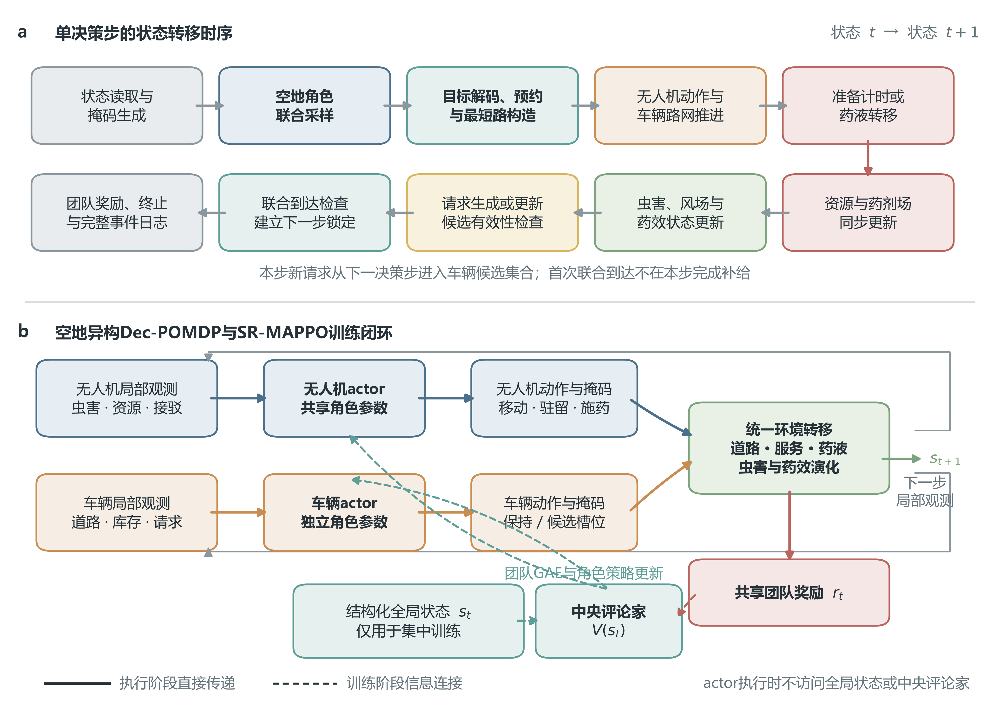

# 4.2 空地异构协同施药决策模型

第4.1节从有限机载药液出发，明确了动态补给需求、车机接驳、服务锁定以及药液转移等基本机制。在此基础上，本节进一步将农田栅格、道路网络、异构资源与离散服务事件统一纳入序贯决策框架，建立空地异构协同施药决策模型。与前述多无人机协同施药问题相比，本节保留虫害演化、药效作用和无人机基础作业行为，新增道路约束移动补给车及其服务决策，使策略不仅需要确定无人机在何处移动与施药，还需协调补给请求、接驳目标和服务时序。需要说明的是，本节用于定义后续环境实现与算法训练共同遵守的模型接口，不预设移动保障或SR-MAPPO的实验性能；动态需求紧迫度与接驳候选生成方法将在第4.3节给出，SR-MAPPO的网络结构和优化过程将在第4.4节展开。

## 4.2.1 农田作业区域与道路网络模型

研究区域沿用第4.1节定义的二维农田区域 $\Omega$，并离散为 $H\times W$ 个栅格。设有效农田单元集合为 $\mathcal{C}^{\mathrm{u}}$，栅格单元 $c\in\mathcal{C}^{\mathrm{u}}$ 的行列索引和米制中心坐标分别为 $\boldsymbol{\iota}_c=(h_c,w_c)$ 与 $\boldsymbol{y}_c$。无人机在有效单元构成的四邻域图 $\mathcal{G}^{\mathrm{u}}=(\mathcal{C}^{\mathrm{u}},\mathcal{E}^{\mathrm{u}})$ 上移动，其邻接关系及对应边长定义为

$$
\begin{aligned}
\mathcal{E}^{\mathrm{u}}
&=\left\{(c,c')\in\mathcal{C}^{\mathrm{u}}\times\mathcal{C}^{\mathrm{u}}:
\left\|\boldsymbol{\iota}_{c}-\boldsymbol{\iota}_{c'}\right\|_{1}=1
\right\},\\
l_{c,c'}^{\mathrm{u}}
&=\left\|\boldsymbol{y}_{c}-\boldsymbol{y}_{c'}\right\|_{2},
\quad (c,c')\in\mathcal{E}^{\mathrm{u}}.
\end{aligned}
\tag{4.9}
$$

式中，$\|\cdot\|_1$ 与 $\|\cdot\|_2$ 分别表示曼哈顿范数和欧氏范数，$l_{c,c'}^{\mathrm{u}}$ 为相邻单元中心之间的物理距离，单位为m。对于非正方形栅格，水平边与竖直边的 $l_{c,c'}^{\mathrm{u}}$ 可取不同数值。边界外单元、不可作业单元及显式障碍区域不进入 $\mathcal{C}^{\mathrm{u}}$，相应移动动作在策略采样前通过动作掩码关闭。由此，无人机动作仍保持第一问中的离散形式，但其实际移动距离由米制网格分辨率确定，而不是将一个动作在不同规模下机械地等同为相同物理距离。

地面车辆沿道路图 $\mathcal{G}^{\mathrm{r}}=(\mathcal{V}^{\mathrm{r}},\mathcal{E}^{\mathrm{r}})$ 运行。道路节点 $n\in\mathcal{V}^{\mathrm{r}}$ 具有米制坐标 $\boldsymbol{y}_{n}^{\mathrm{r}}$，道路边 $e=(n,n')\in\mathcal{E}^{\mathrm{r}}$ 的长度记为 $l_e^{\mathrm{r}}$。设 $\Gamma_{n,n'}$ 为连接节点 $n$ 与 $n'$ 的全部可行道路路径集合，则两节点间的最短路距离和在车辆 $v$ 作业速度下的预计行驶时间分别为

$$
d_{\mathcal{G}^{\mathrm{r}}}(n,n')
=\min_{\varpi\in\Gamma_{n,n'}}\sum_{e\in\varpi}l_e^{\mathrm{r}},
\qquad
T_{v}^{\mathrm{g}}(n,n')
=\frac{d_{\mathcal{G}^{\mathrm{r}}}(n,n')}{v_v^{\mathrm{g}}}.
\tag{4.10}
$$

式中，$v_v^{\mathrm{g}}$ 为车辆 $v$ 的作业速度，单位为m/s。当 $\Gamma_{n,n'}=\varnothing$ 时，目标道路节点不可达，对应车辆动作必须被掩蔽。道路数据在进入仿真前统一投影至米制坐标系，并通过折线加密、四连通拓扑构建、连通分量检测和离散化缺口审计生成可复现道路缓存。对于同一物理区域的六档网格规模，地图范围、物理速度和决策步长保持一致；无人机与车辆分别按 $v_i^{\mathrm{u}}\Delta t_{\mathrm{dec}}$ 和 $v_v^{\mathrm{g}}\Delta t_{\mathrm{dec}}$ 积累单步移动预算，跨越栅格单元或道路边后保留未使用距离，从而避免网格分辨率改变主体的实际速度。

候选接驳点集合沿用 $\mathcal{P}_t$。对接驳点 $p\in\mathcal{P}_t$，以 $\nu(p)\in\mathcal{V}^{\mathrm{r}}$ 表示其关联道路节点，以 $\boldsymbol{y}_{p}^{\mathrm{rv}}$ 表示接驳区域的米制参考位置。设 $R^{\mathrm{rv}}$ 为服务半径，$n_{v,t}^{\mathrm{g}}$ 为车辆当前所在或已完成边推进后到达的道路节点，则车机空间服务条件可表示为

$$
\mathbb{I}_{i,v,p,t}^{\mathrm{rv}}
=\mathbb{I}\!\left(n_{v,t}^{\mathrm{g}}=\nu(p)\right)
\mathbb{I}\!\left(
\left\|\boldsymbol{x}_{i,t}^{\mathrm{u}}-
\boldsymbol{y}_{p}^{\mathrm{rv}}\right\|_{2}
\leq R^{\mathrm{rv}}
\right).
\tag{4.11}
$$

式中，$\mathbb{I}(\cdot)$ 为示性函数。只有道路节点可达且无人机能够进入服务半径的点才可作为有效接驳点。第4.3节将在该基本条件上进一步结合请求紧迫度、双方预计到达时间和绕行代价生成有限候选集合；本节不以任意道路投影点替代可服务接驳点，也不允许车辆脱离道路图直接穿越农田。

## 4.2.2 无人机与移动补给车资源模型

空地异构主体具有不同的资源状态与作业功能。对无人机 $i\in\mathcal{U}$，以 $m_{i,t}^{\mathrm{u}}$ 表示其运行状态，以 $b_{i,t}$ 和 $b_i^{\mathrm{max}}$ 分别表示保留的电量状态与额定电量。无人机资源状态可写为

$$
\boldsymbol{z}_{i,t}^{\mathrm{u}}
=\left[
\boldsymbol{x}_{i,t}^{\mathrm{u}},
\frac{q_{i,t}}{q_i^{\mathrm{max}}},
\frac{b_{i,t}}{b_i^{\mathrm{max}}},
m_{i,t}^{\mathrm{u}}
\right].
\tag{4.12}
$$

本章研究对象仅为药液补给。电量状态若在仿真中保留，只用于维持与第一问相同的飞行可行性约束，移动补给车不承担充电或电池更换；正式实验需要通过资源激活诊断保证电量不会先于药液成为主要瓶颈。第一问中的固定补给站自动补给在本章主实验中关闭，固定保障对照由资源和服务能力均与移动补给车匹配的固定车辆实现。

无人机执行施药动作时，单步实际药液消耗量受剩余药液和标定施药流量共同限制。设 $a_{i,t}^{\mathrm{u}}$ 为无人机动作，$\rho_i^{\mathrm{spr}}$ 为施药流量，单位为L/s，则

$$
s_{i,t}=
\mathbb{I}\!\left(a_{i,t}^{\mathrm{u}}=a^{\mathrm{spr}}\right)
\min\left\{q_{i,t},\rho_i^{\mathrm{spr}}\Delta t_{\mathrm{dec}}\right\}.
\tag{4.13}
$$

当 $q_{i,t}$ 小于一次有效施药所需的最小药量时，施药动作不可行；无人机仍可移动、驻留、前往接驳点并接受补给。药液消耗与补给转移后的 $q_{i,t+1}$ 以及车辆库存 $Q_{v,t+1}$ 按第4.1节式（4.6）更新，并通过式（4.7）执行全局药液守恒审计，避免重复入账、负库存或服务完成后药量不一致。

对车辆 $v\in\mathcal{V}$，设 $m_{v,t}^{\mathrm{g}}$ 为其运行状态，$\kappa_{v,t}$ 为当前预约请求标识，$p_{v,t}^{\mathrm{tar}}$ 为目标接驳点，$\tau_{v,t}^{\mathrm{svc}}$ 为当前服务阶段剩余时间。其资源与任务状态表示为

$$
\boldsymbol{z}_{v,t}^{\mathrm{g}}
=\left[
\boldsymbol{x}_{v,t}^{\mathrm{g}},
\frac{Q_{v,t}}{Q_{v,0}},
m_{v,t}^{\mathrm{g}},
\kappa_{v,t},
p_{v,t}^{\mathrm{tar}},
\frac{\tau_{v,t}^{\mathrm{svc}}}{T^{\mathrm{ref}}}
\right].
\tag{4.14}
$$

式中，$T^{\mathrm{ref}}>0$ 为冻结的时间归一化尺度。主实验采用一辆移动补给车，以突出保障位置变化对施药连续性的影响；上述集合化表示保留多车辆扩展能力。车辆库存耗尽后设置独立的库存耗尽标志，并关闭新的补给服务动作，但不改变车辆运行状态定义，也不触发回合终止。

## 4.2.3 补给请求与服务状态转移模型

为避免将请求进度、主体运动和服务阶段混为同一状态，本研究分别定义请求生命周期与主体运行状态。设 $\sigma_{i,t}^{\mathrm{req}}$ 为无人机 $i$ 的请求状态，其取值集合为

$$
\mathcal{S}^{\mathrm{req}}=
\left\{
0,1,2,3,4,5,6,7
\right\},
\tag{4.15}
$$

其中，0至7依次表示未激活、开放、已预约、服务中、已满足、部分满足、已取消和未满足。为使状态转移能够由当前记录唯一确定，定义请求记录 $\boldsymbol{\xi}_{i,t}^{\mathrm{req}}$，其中包含请求状态 $\sigma_{i,t}^{\mathrm{req}}$、请求标识 $\kappa_{i,t}^{\mathrm{req}}$、生成时刻 $t_i^{\mathrm{gen}}$、目标补给量 $d_i^{\mathrm{tar}}$、剩余需求 $d_{i,t}^{\mathrm{req}}$、累计实际转移量 $\bar q_{i,t}^{\mathrm{tr}}$、紧迫度 $u_{i,t}^{\mathrm{req}}$、预约车辆 $\kappa_{i,t}^{\mathrm{g}}$、目标接驳点 $p_{i,t}^{\mathrm{tar}}$ 和闭合原因 $\chi_{i,t}^{\mathrm{req}}$。同一无人机在任一时刻至多存在一个处于开放、已预约、服务中或部分满足待处理状态的有效请求；已有请求未闭合前，动态触发机制不得重复生成新请求。

设 $g_{i,t}^{\mathrm{gen}}$、$g_{i,v,p,t}^{\mathrm{res}}$、$g_{i,v,p,t}^{\mathrm{start}}$、$g_{i,v,t}^{\mathrm{full}}$、$g_{i,v,t}^{\mathrm{part}}$、$g_{i,t}^{\mathrm{reopen}}$、$g_{i,t}^{\mathrm{cancel}}$ 和 $g_{i,t}^{\mathrm{unmet}}$ 分别为请求生成、预约、服务开始、完全满足、部分满足、重新开放、取消和未满足守卫变量，并构成互斥事件向量 $\boldsymbol{g}_{i,t}^{\mathrm{req}}$。记 $Q_t^{\mathrm{svc}}$ 为当前仍可用于该请求且满足路网可达与服务条件的车辆药液总量，则请求记录按确定性转移函数更新：

$$
\begin{aligned}
\boldsymbol{\xi}_{i,t}^{\mathrm{req}}
&=\left[
\sigma_{i,t}^{\mathrm{req}},
\kappa_{i,t}^{\mathrm{req}},
t_i^{\mathrm{gen}},
d_i^{\mathrm{tar}},
d_{i,t}^{\mathrm{req}},
\bar q_{i,t}^{\mathrm{tr}},
u_{i,t}^{\mathrm{req}},
\kappa_{i,t}^{\mathrm{g}},
p_{i,t}^{\mathrm{tar}},
\chi_{i,t}^{\mathrm{req}}
\right],\\
\boldsymbol{\xi}_{i,t+1}^{\mathrm{req}}
&=F_{\mathrm{req}}\!\left(
\boldsymbol{\xi}_{i,t}^{\mathrm{req}},
\boldsymbol{g}_{i,t}^{\mathrm{req}},
Q_t^{\mathrm{svc}},
\sum_{v\in\mathcal{V}}\delta q_{i,v,t}
\right).
\end{aligned}
\tag{4.16}
$$

其中，$\delta q_{i,v,t}$ 为当前步的实际药液转移量。所有守卫变量均由当前状态、当前步事件和已冻结规则计算，不依赖未来信息；同一步至多触发一个改变请求生命周期的守卫。开放请求被车辆接受后，建立唯一的“请求—车辆—无人机—接驳点”关联并转入已预约状态；车辆和无人机均满足到达条件、请求归属一致且车辆库存为正时，下一决策步进入服务中状态。每步先按实际转移量更新 $\bar q_{i,t}^{\mathrm{tr}}$，再由 $d_{i,t+1}^{\mathrm{req}}=[d_i^{\mathrm{tar}}-\bar q_{i,t+1}^{\mathrm{tr}}]_{+}$ 更新剩余需求。若其减至0，则触发 $g_{i,v,t}^{\mathrm{full}}$ 并转为已满足；若一次服务批次结束后仍大于0，则触发 $g_{i,v,t}^{\mathrm{part}}$ 并进入部分满足，解除原预约关系。处于部分满足状态时，若 $d_{i,t}^{\mathrm{req}}>0$ 且 $Q_t^{\mathrm{svc}}>0$，下一步触发 $g_{i,t}^{\mathrm{reopen}}$ 并重新开放；若已无可用服务能力，则触发 $g_{i,t}^{\mathrm{unmet}}$。请求主动撤销转为已取消，候选点失效、车辆不可达、任务条件变化和回合截断则依据冻结的原因码转为已取消或未满足。两类闭合守卫和原因码分别记录，不能统一写成“服务失败”，也不能记作请求满足。

服务中状态进一步划分为准备阶段和药液转移阶段。设 $\zeta_{i,v,t}^{\mathrm{svc}}\in\{0,1,2\}$ 分别表示无服务、准备和转移，$\tau_{i,v,t}^{\mathrm{setup}}$ 为剩余准备时间，则服务阶段更新满足

$$
\begin{aligned}
\tau_{i,v,t+1}^{\mathrm{setup}}
&=\begin{cases}
T^{\mathrm{setup}}, & g_{i,v,p,t}^{\mathrm{start}}=1,\\
\left[\tau_{i,v,t}^{\mathrm{setup}}-\Delta t_{\mathrm{dec}}\right]_{+},
& \zeta_{i,v,t}^{\mathrm{svc}}=1,\\
\tau_{i,v,t}^{\mathrm{setup}}, & \text{其他},
\end{cases}\\
\zeta_{i,v,t+1}^{\mathrm{svc}}
&=\begin{cases}
1, & g_{i,v,p,t}^{\mathrm{start}}=1,\\
2, & \zeta_{i,v,t}^{\mathrm{svc}}=1\ \text{且}\
\tau_{i,v,t+1}^{\mathrm{setup}}=0,\\
0, & g_{i,v,t}^{\mathrm{full}}=1\ \text{或}\
g_{i,v,t}^{\mathrm{part}}=1,\\
\zeta_{i,v,t}^{\mathrm{svc}}, & \text{其他}.
\end{cases}
\end{aligned}
\tag{4.17}
$$

式中，$[\cdot]_{+}$ 表示非负截断。首次联合到达只建立下一决策步的服务锁定；服务开始事件将剩余准备时间初始化为 $T^{\mathrm{setup}}$，随后逐步扣减，准备结束后再按第4.1节式（4.5）转移药液。因此，同一决策步内不允许连续完成到达、准备、补给和恢复施药，车辆行驶时间、等待时间及服务时间均具有明确的物理含义。

请求被预约后，无人机并非立即失去所有作业自主性，而是进入有限承诺状态。设 $\hat{T}_{i,p,t}^{\mathrm{u}}$ 为无人机到已预约接驳点的预计飞行时间，$\Delta T^{\mathrm{safe}}$ 为安全余量。当剩余可施药时长无法覆盖前往接驳点的时间与安全余量时，定义最迟出发约束为

$$
\mathbb{I}_{i,t}^{\mathrm{dep}}
=\mathbb{I}\!\left(
\hat{T}_{i,t}^{\mathrm{remain}}
\leq
\hat{T}_{i,p,t}^{\mathrm{u}}+\Delta T^{\mathrm{safe}}
\right).
\tag{4.18}
$$

当 $\mathbb{I}_{i,t}^{\mathrm{dep}}=0$ 时，无人机可继续施药或提前前往接驳点；当其取1时，施药和增加最短飞行距离的移动动作被掩蔽，只保留缩短接驳距离的移动动作，抵达后允许驻留。该机制在策略自由度与服务履约之间形成明确边界，同时避免环境在动作采样后强行改变无人机行为。
若当前不存在能够严格缩短接驳距离的合法移动动作，则放行驻留动作作为唯一回退动作，并在事件日志中记录 `fallback_hold`；不得放行越界、远离接驳点或违反服务承诺的动作。

本节采用固定的事件优先级。时刻 $t$ 首先生成观测与动作掩码，随后联合采样动作；车辆动作经候选映射解码后建立预约并构造路径，无人机执行合法移动或施药，车辆沿既定道路路径推进；步初已经锁定的服务执行准备计时或药液转移，继而更新资源、药剂场和虫害生态状态；最后生成或更新请求、检查联合到达、计算奖励并判断终止。由此，本步新生成的请求从下一决策步开始进入车辆候选集合，保证动作只依赖采样时刻已经可观测的信息。

## 4.2.4 空地异构Dec-POMDP建模

由于无人机与车辆只能获得与自身角色相关的局部信息，且不同主体的联合动作共同影响虫害治理与后续补给机会，本文将空地协同施药过程建模为异构分散部分可观测马尔可夫决策过程，即

$$
\mathcal{M}=
\left\langle
\mathcal{N},\mathcal{S},
\{\mathcal{O}^{z}\}_{z\in\{\mathrm{u},\mathrm{g}\}},
\{\mathcal{A}^{z}\}_{z\in\{\mathrm{u},\mathrm{g}\}},
P,\mathcal{Z},R,\gamma
\right\rangle.
\tag{4.19}
$$

式中，$\mathcal{N}=\mathcal{U}\cup\mathcal{V}$ 为异构主体集合；$\mathcal{S}$ 为全局状态空间；$\mathcal{O}^{\mathrm{u}}$ 和 $\mathcal{O}^{\mathrm{g}}$ 分别为无人机与车辆的局部观测空间；$\mathcal{A}^{\mathrm{u}}$ 和 $\mathcal{A}^{\mathrm{g}}$ 分别为两类角色动作空间；$P$ 为同时包含主体运动、虫害与药效演化、请求和服务事件的状态转移函数；$\mathcal{Z}$ 为全局状态到角色局部观测的观测函数；$R$ 为共享团队奖励；$\gamma\in(0,1]$ 为折扣因子。采用 $\mathcal{Z}$ 表示观测函数，以区别表示农田区域的 $\Omega$。

本文采用集中训练、分散执行范式。训练阶段，中央评论家访问结构化全局状态以评价联合决策；执行阶段，无人机和车辆分别依据角色局部观测独立选择动作。考虑同一角色内主体功能一致，无人机共享一个角色actor，车辆共享另一个角色actor；两类actor的参数及优化器相互独立。联合策略分解为

$$
\Pi(\boldsymbol{a}_t\mid\boldsymbol{o}_t)
=\prod_{i\in\mathcal{U}}
\pi_{\mathrm{u}}\!\left(
a_{i,t}^{\mathrm{u}}\mid o_{i,t}^{\mathrm{u}}
\right)
\prod_{v\in\mathcal{V}}
\pi_{\mathrm{g}}\!\left(
a_{v,t}^{\mathrm{g}}\mid o_{v,t}^{\mathrm{g}}
\right).
\tag{4.20}
$$

该结构是SR-MAPPO在空地异构任务下的角色化扩展，算法名称仍统一为SR-MAPPO。异构性体现在角色观测、动作语义和actor参数不同，而不是引入新的算法名称。中央评论家对每个联合转移输出一个团队价值，团队优势与广义优势估计在共享轨迹上计算一次；角色actor仅使用自身有效策略样本更新，具体网络与损失函数将在第4.4节给出。

**图4-3  空地异构协同施药决策模型**

图4-3（a）给出了单决策步内动作、物理运动、服务事件、生态演化与奖励计算的先后关系；图4-3（b）展示了集中训练、分散执行条件下无人机actor、车辆actor和中央评论家的信息边界。实线表示执行阶段实际发生的状态、观测和动作传递，虚线表示仅在训练阶段使用的全局状态、团队价值与优化信息。

## 4.2.5 全局状态与角色局部观测

中央评论家的输入不再采用全部局部观测的简单拼接，而是由具有明确语义的状态块构成。设 $s_t^{\mathrm{eco}}$、$s_t^{\mathrm{u}}$、$s_t^{\mathrm{g}}$、$s_t^{\mathrm{req}}$、$s_t^{\mathrm{svc}}$ 和 $s_t^{\mathrm{time}}$ 分别表示生态状态、无人机群状态、车辆与道路状态、请求状态、服务关联状态及时间状态，则

$$
s_t=\left[
s_t^{\mathrm{eco}},
s_t^{\mathrm{u}},
s_t^{\mathrm{g}},
s_t^{\mathrm{req}},
s_t^{\mathrm{svc}},
s_t^{\mathrm{time}}
\right].
\tag{4.21}
$$

其中，$s_t^{\mathrm{eco}}$ 包含虫害密度场、药效场、风场和必要的静态农田属性；$s_t^{\mathrm{u}}$ 包含全部无人机位置、剩余药液、保留电量、请求归属和运行状态；$s_t^{\mathrm{g}}$ 包含车辆道路位置、库存、当前路径和运行状态；$s_t^{\mathrm{req}}$ 包含开放、已预约及服务中请求的剩余需求和紧迫度；$s_t^{\mathrm{svc}}$ 包含接驳点、双方到达标志、准备计时和服务锁定；$s_t^{\mathrm{time}}$ 表示归一化物理时间和回合进度。该结构只在集中训练阶段提供给中央评论家，不进入角色actor的执行输入。

无人机局部观测应支持虫害治理、资源管理和接驳履约三类决策。对无人机 $i$，定义

$$
o_{i,t}^{\mathrm{u}}=\left[
o_{i,t}^{\mathrm{field}},
o_{i,t}^{\mathrm{self}},
o_{i,t}^{\mathrm{near}},
o_{i,t}^{\mathrm{req}},
o_{i,t}^{\mathrm{rv}},
o_{i,t}^{\mathrm{env}}
\right].
\tag{4.22}
$$

式中，$o_{i,t}^{\mathrm{field}}$ 为当前位置附近的虫害与药效特征；$o_{i,t}^{\mathrm{self}}$ 为归一化位置、剩余药液、保留电量和运行状态；$o_{i,t}^{\mathrm{near}}$ 为邻近无人机相对位置及必要协同信息；$o_{i,t}^{\mathrm{req}}$ 为自身请求状态、剩余需求和预约归属；$o_{i,t}^{\mathrm{rv}}$ 为已预约接驳点相对位置、预计到达时间及车辆状态摘要；$o_{i,t}^{\mathrm{env}}$ 为当前风场、局部农田属性和回合时间。未预约时，与接驳相关的固定槽位以零填充并设置相应有效标志。

车辆承担的是请求选择和保障位置调整任务，不直接依据完整虫害场追逐虫害热点。对车辆 $v$，其局部观测定义为

$$
o_{v,t}^{\mathrm{g}}=\left[
o_{v,t}^{\mathrm{road}},
o_{v,t}^{\mathrm{self}},
o_{v,t}^{\mathrm{task}},
\{o_{v,k,t}^{\mathrm{pair}}\}_{k=1}^{K_{\mathrm{max}}},
o_{v,t}^{\mathrm{time}}
\right].
\tag{4.23}
$$

其中，$o_{v,t}^{\mathrm{road}}$ 表示当前道路节点、相邻拓扑和剩余路径；$o_{v,t}^{\mathrm{self}}$ 表示库存、运行状态和剩余服务时间；$o_{v,t}^{\mathrm{task}}$ 表示当前预约任务；$o_{v,k,t}^{\mathrm{pair}}$ 为第 $k$ 个“请求—接驳点”候选槽位，至少包含请求剩余需求、紧迫度、无人机和车辆预计到达时间、路网距离以及候选有效标志；$o_{v,t}^{\mathrm{time}}$ 为归一化时间信息。候选槽位按照第4.3节冻结的确定性规则排序，数量不足时零填充，超出上限时只保留排序靠前的 $K_{\mathrm{max}}$ 个组合。

主实验采用决策步级同步可靠通信。角色间允许共享请求标识、剩余需求、接驳点标识、预约归属、当前运行状态和依据当前信息计算的预计到达时间；不共享未来虫情、未来道路状态、完整全局虫害场或评论家专属状态。通信延迟、丢包和带宽竞争不进入主实验，以避免在尚未验证补给机制前同时引入新的不确定性来源。

## 4.2.6 异构动作空间与可行性约束

无人机继承第一问的六类离散动作，即上移、下移、左移、右移、驻留和施药。其动作集合为

$$
\mathcal{A}^{\mathrm{u}}=
\left\{
a^{\mathrm{up}},a^{\mathrm{down}},a^{\mathrm{left}},
a^{\mathrm{right}},a^{\mathrm{stay}},a^{\mathrm{spr}}
\right\}.
\tag{4.24}
$$

补给请求由第4.1节定义的动态时间条件触发，不额外设置“请求补给”动作；无人机前往接驳点仍通过基础移动动作完成。移动边界、不可作业单元、施药药量、服务锁定和最迟出发约束共同决定无人机动作掩码。

车辆actor采用固定维数的高层动作空间。设候选槽位上限为 $K_{\mathrm{max}}$，则

$$
\mathcal{A}^{\mathrm{g}}=
\left\{a^{\mathrm{hold}}\right\}
\cup
\left\{a_{k}^{\mathrm{pair}}\right\}_{k=1}^{K_{\mathrm{max}}},
\qquad
\Psi_{v,t}(k)=
\left(\kappa_{v,k,t}^{\mathrm{req}},p_{v,k,t}^{\mathrm{rv}}\right).
\tag{4.25}
$$

式中，$a^{\mathrm{hold}}$ 表示保持空闲或继续当前任务；$a_k^{\mathrm{pair}}$ 表示选择第 $k$ 个候选槽位；$\Psi_{v,t}$ 将槽位映射为具体请求标识与接驳点标识。车辆只有在空闲且库存为正时才能选择新的有效组合，处于已预约、在途、等待、准备或转移状态时只允许 $a^{\mathrm{hold}}$，既有道路路径由确定性最短路执行器继续推进。由此，SR-MAPPO学习的是车辆服务请求与接驳目标的高层调度，而不是车辆在道路上的逐边路径搜索。

设 $l_{n,t}^{z}$ 为角色 $z\in\{\mathrm{u},\mathrm{g}\}$ 的第 $n$ 个动作logit，$m_{n,t}^{z}\in\{0,1\}$ 为对应动作掩码，则掩码后的策略分布定义为

$$
\widetilde{\pi}_{z}\!\left(a_n\mid o_t^{z},\boldsymbol{m}_t^{z}\right)
=\frac{m_{n,t}^{z}\exp(l_{n,t}^{z})}
{\sum_{j}m_{j,t}^{z}\exp(l_{j,t}^{z})}.
\tag{4.26}
$$

每个主体至少保留一个合法动作，以避免分母为零。车辆候选槽位只有在请求开放、尚未被预约、接驳点有效、道路可达、车辆库存为正且服务能力满足基本条件时才取1。动作采样、旧log-prob记录和PPO更新必须使用采样时保存的同一动作掩码；对于车辆，还必须同步保存 $\Psi_{v,t}$，禁止利用后续状态重新构造旧候选集合。

服务锁定等状态可能使主体只剩唯一合法动作。此类转移仍用于团队回报、团队广义优势估计和中央评论家训练，但不计入对应角色actor的策略损失与熵损失。为此，每条轨迹同时保存角色与主体标识、局部观测、结构化全局状态、动作、原始掩码、候选映射、旧log-prob、价值预测、共享奖励、终止与截断标志、有效策略样本标志及归一化统计版本。该设计使行为策略与训练策略保持一致，并为后续梯度隔离、掩码概率重放和确定性评估冻结测试提供接口。

## 4.2.7 团队奖励函数与优化目标

空地协同施药属于完全合作任务，所有无人机与车辆接收同一团队奖励。奖励函数需要同时反映虫害治理进展、补给需求满足和协同运行代价，但不能用多项奖励重复描述同一物理事件。设栅格 $c$ 在时刻 $t$ 的虫害密度为 $\varrho_{c,t}$，农田权重为 $\omega_c$，则加权虫害负荷与截至时刻 $t$ 的消减率分别定义为

$$
B_t=\sum_{c\in\mathcal{C}^{\mathrm{u}}}\omega_c\varrho_{c,t},
\qquad
\eta_{\mathrm{red},t}=1-\frac{B_t}{B_0+\varepsilon}.
\tag{4.27}
$$

式中，$\varepsilon>0$ 用于避免初始虫害负荷为零时分母无定义。治理奖励由单步虫害负荷下降与终端治理结果构成：

$$
r_t^{\mathrm{control}}
=\alpha_{\mathrm{red}}
\frac{B_t-B_{t+1}}{B_0+\varepsilon}
+\mathbb{I}_{t}^{\mathrm{ter}}
\left[
\alpha_{\mathrm{suc}}\mathbb{I}\!\left(\eta_{\mathrm{red},t+1}\geq0.85\right)
-\alpha_{\mathrm{fail}}\mathbb{I}\!\left(\eta_{\mathrm{red},t+1}<0.85\right)
\right].
\tag{4.28}
$$

其中，$\mathbb{I}_{t}^{\mathrm{ter}}$ 为回合终止或截断指示量。若后续采用势函数塑形，则应以 $\gamma\Phi(s_{t+1})-\Phi(s_t)$ 替代相应的稠密治理进展项，而不是与同义的虫害下降奖励叠加。

设 $d_{i,t}^{\mathrm{req}}$ 为请求 $i$ 在时刻 $t$ 的剩余需求量，$\delta q_{i,v,t}$ 为车辆 $v$ 在当前步向无人机 $i$ 实际转移的药液量，$\mathbb{I}_{i,t}^{\mathrm{sat}}$ 表示该请求因累计实际转移量达到目标而在当前步首次转为已满足，则服务奖励定义为

$$
r_t^{\mathrm{service}}
=\alpha_{\mathrm{gap}}
\frac{\sum_{i\in\mathcal{U}}
\min\!\left\{
d_{i,t}^{\mathrm{req}},
\sum_{v\in\mathcal{V}}\delta q_{i,v,t}
\right\}}
{Q^{\mathrm{ref}}}
+\alpha_{\mathrm{sat}}
\sum_{i\in\mathcal{U}}\mathbb{I}_{i,t}^{\mathrm{sat}}.
\tag{4.29}
$$

式中，$Q^{\mathrm{ref}}>0$ 为药液参考尺度。第一项只奖励经药液守恒账本确认且实际用于填补请求缺口的转移量，第二项仅对由累计实际转移触发的一次性请求满足事件提供奖励。请求取消、候选点失效、车辆不可达、任务条件变化或回合截断造成的请求关闭及剩余需求字段清零均不产生服务奖励；同一请求的重复状态读取也不产生新的完成奖励，从而避免策略通过异常闭合、频繁小额补给或重复服务获得额外收益。

协同代价由车机等待、药液失能、无人机接驳绕行、车辆道路行驶和重复施药构成。设 $\Delta T_{t}^{\mathrm{wait,u}}$、$\Delta T_{t}^{\mathrm{wait,g}}$、$\Delta T_{t}^{\mathrm{off}}$、$\Delta D_{t}^{\mathrm{rv,u}}$、$\Delta D_{t}^{\mathrm{g}}$ 和 $N_t^{\mathrm{rep}}$ 分别为当前步对应增量，则

$$
\begin{aligned}
r_t^{\mathrm{coord}}
={}&\beta_{\mathrm{wu}}
\frac{\Delta T_{t}^{\mathrm{wait,u}}}{T^{\mathrm{ref}}}
+\beta_{\mathrm{wg}}
\frac{\Delta T_{t}^{\mathrm{wait,g}}}{T^{\mathrm{ref}}}
+\beta_{\mathrm{off}}
\frac{\Delta T_{t}^{\mathrm{off}}}{T^{\mathrm{ref}}}\\
&+\beta_{\mathrm{ru}}
\frac{\Delta D_{t}^{\mathrm{rv,u}}}{D^{\mathrm{u,ref}}}
+\beta_{\mathrm{g}}
\frac{\Delta D_{t}^{\mathrm{g}}}{D^{\mathrm{g,ref}}}
+\beta_{\mathrm{rep}}
\frac{N_t^{\mathrm{rep}}}{N^{\mathrm{ref}}}.
\end{aligned}
\tag{4.30}
$$

训练奖励中的时间状态按服务锁定、接驳等待、药液失能和正常作业的顺序互斥计数，防止同一主体在同一步被重复惩罚。事件日志仍分别保存原始等待和失能标志，以便实验阶段检验二者是否重叠。无效动作惩罚 $r_t^{\mathrm{invalid}}$ 仅用于捕获掩码或协议接口异常，不作为主要学习信号；正常运行时，被掩蔽动作的采样概率和执行次数均应为零。

综合上述分量，团队奖励和有限时域优化目标分别为

$$
r_t=r_t^{\mathrm{control}}+r_t^{\mathrm{service}}
-r_t^{\mathrm{coord}}-r_t^{\mathrm{invalid}},
\qquad
J(\Pi)=\mathbb{E}_{\Pi}\!\left[
\sum_{t=0}^{T-1}\gamma^{t}r_t
\right].
\tag{4.31}
$$

各奖励项在加权前均通过物理参考尺度无量纲化，权重仅在训练集与验证集上确定并冻结，封存测试场景不参与调参。训练回报用于引导策略学习，不替代最终治理评价。后续实验仍以固定测试场景上的虫害消减率、85%治理达标率、请求等待时间、药液失能时间、有效施药时间、接驳绕行距离、车辆道路行驶距离和请求满足情况作为主要结果与机制指标。达到治理目标时回合可正常终止，达到最大物理时长时截断；车辆库存或无人机药液耗尽均不单独终止回合，药效场和虫害状态仍按既定动力学继续演化。

至此，本节完成了从物理空间、异构资源和服务事件到局部观测、角色动作及团队目标的统一建模。该模型将移动保障的潜在作用限定为可检验的机制链，即车辆移动改变接驳位置与服务时序，进而影响等待、药液失能和有效施药时间，最终可能改变虫害治理结果。上述关系将在后续代码实现中首先通过道路拓扑、状态转移、药液守恒、动作掩码与轨迹重放测试进行验证，再通过资源约束激活、固定与移动保障对照以及机制指标分析检验其适用条件。
